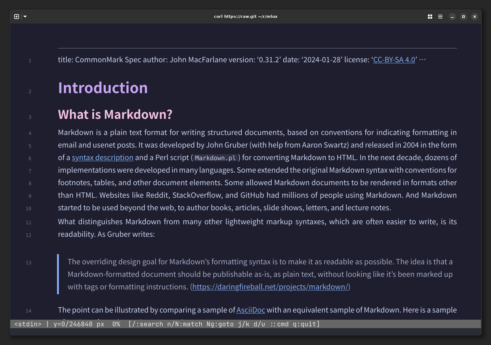

# mlux

[](https://github.com/saka1/mlux/actions/workflows/ci.yml)

A rich Markdown viewer for modern terminals,
powered by Rust and [Typst](https://typst.app/).



## How it works

Modern terminals like [Kitty](https://sw.kovidgoyal.net/kitty/) and [Ghostty](https://ghostty.org/) that support the
[Kitty Graphics Protocol](https://sw.kovidgoyal.net/kitty/graphics-protocol/) can display
images inline. mlux takes advantage of this: it parses Markdown, converts it to Typst markup, and renders high-quality typeset output as a PNG image.
The built-in terminal viewer then displays the rendered document directly in your terminal.

## Features

- **Beautiful output** -- Typst's typesetting engine handles line breaking, paragraph
  spacing, headings, code blocks, tables, blockquotes, and more.
- **Terminal viewer** -- View rendered Markdown directly in your terminal with
  pixel-precise line numbers, vim-style scrolling, and tile-based lazy rendering.
  Requires a terminal that supports the Kitty Graphics Protocol (e.g. Ghostty, Kitty).
- **Heading picker** -- Press `/` to open an interactive picker that lists headings and jumps to your selection.
- **File watching** -- Automatically re-renders when the source file changes.

## Requirements

mlux requires a terminal that supports the
[Kitty Graphics Protocol](https://sw.kovidgoyal.net/kitty/graphics-protocol/).
Compatible terminals include [Kitty](https://sw.kovidgoyal.net/kitty/) and [Ghostty](https://ghostty.org/).

## Installation

```
cargo install mlux
```

## Usage

```console
# View in terminal (default)
mlux input.md

# Render to PNG
mlux render input.md -o output.png

# Custom width, resolution, and theme
mlux render input.md -o output.png --width 800 --ppi 144 --theme catppuccin
```

### Viewer keybindings

| Key | Action |
|-----|--------|
| `j` / `k` | Scroll down / up |
| `d` / `u` | Half-page down / up |
| `g` / `G` | Jump to top / bottom |
| `[N]g` / `[N]G` | Jump to line N |
| `/` | Search headings |
| `n` / `N` | Next / previous search match |
| `y` / `Y` | Yank line / block |
| `q` | Quit |

## Configuration

mlux reads settings from `~/.config/mlux/config.toml` (respects `$XDG_CONFIG_HOME`).
All fields are optional — omit any to use the default.

```toml
# Theme name (loaded from themes/{name}.typ)
theme = "catppuccin"

# Page width in pt (default: 660)
width = 660.0

# Resolution in pixels per inch (default: 144)
ppi = 144.0

[viewer]
# Scroll distance per j/k press in terminal cells (default: 3)
scroll_step = 3

# Redraw frame budget in milliseconds (default: 32)
frame_budget_ms = 32

# Minimum tile height in pt (default: 500)
tile_height = 500.0

# Sidebar width in terminal columns (default: 6)
sidebar_cols = 6

# LRU tile eviction distance (default: 4)
evict_distance = 4

# File watch polling interval in milliseconds (default: 200)
watch_interval_ms = 200
```

CLI options override config file values. For example, `mlux render input.md --ppi 288`
uses PPI 288 regardless of the config file.

