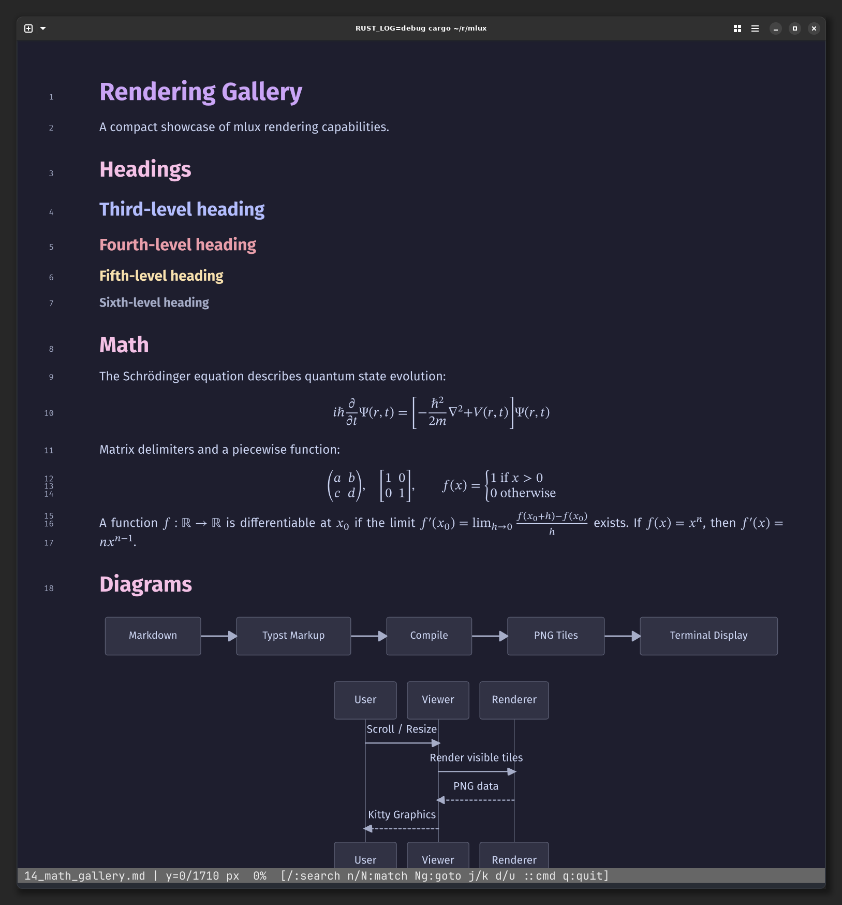
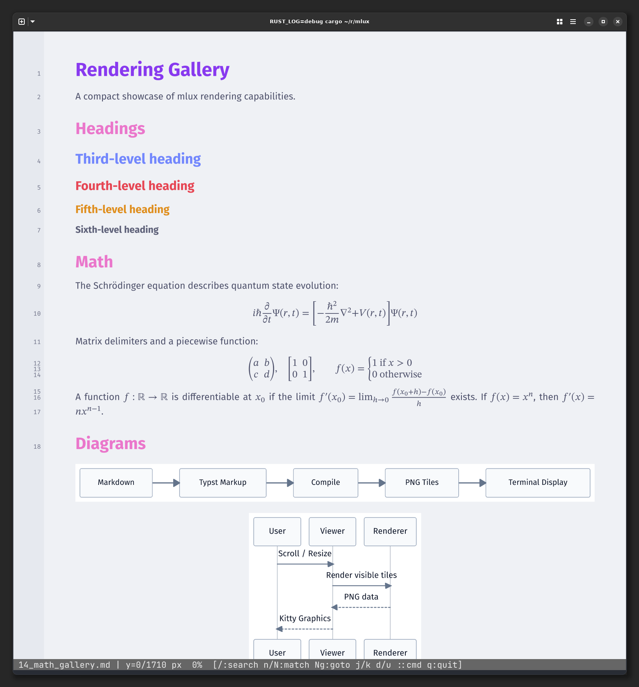

# mlux

[](https://github.com/saka1/mlux/actions/workflows/ci.yml)

A rich Markdown viewer for modern terminals,
powered by Rust and [Typst](https://typst.app/).


## How it works

Modern terminals like [Kitty](https://sw.kovidgoyal.net/kitty/) and [Ghostty](https://ghostty.org/) that support the
[Kitty Graphics Protocol](https://sw.kovidgoyal.net/kitty/graphics-protocol/) can display
images inline. mlux takes advantage of this: it parses Markdown, converts it to Typst markup, and renders high-quality typeset output as a PNG image.
The built-in terminal viewer then displays the rendered document directly in your terminal.

## Features

- **Beautiful output** -- Typst's typesetting engine handles line breaking, paragraph
  spacing, headings, code blocks, tables, blockquotes, and more.
- **Images and math** -- Local images and LaTeX math formulas (`$...$`, `$$...$$`) are
  rendered inline. Remote images (`http://`, `https://`) can be fetched with `--allow-remote-images`.
- **Mermaid diagrams** -- Fenced `mermaid` code blocks are rendered as SVG diagrams
  inline.
- **Terminal viewer** -- View rendered Markdown directly in your terminal with
  pixel-precise line numbers, vim-style scrolling, and tile-based lazy rendering.
  Requires a terminal that supports the Kitty Graphics Protocol (e.g. Ghostty, Kitty).
- **Link navigation** -- Press `No` on a local `.md` link to jump to that file (tag-jump).
  `Ctrl-O` returns to the previous file with scroll position restored.
- **Search** -- Press `/` to search forward or `?` to search backward: type a
  regex and press Enter to jump to the first match with pixel-precise overlay
  highlights. Press `n`/`N` to navigate matches (direction follows the
  original search). Use `:noh` to hide highlights without clearing the search
  (`:grep` opens a full-screen search picker).
- **URL picker** -- Press `O` to list all URLs in the document and open one in your browser.
- **Yank** -- Copy source lines or blocks to clipboard via OSC 52 (`Ny`, `NY`).
- **Git diff markers** -- When viewing a file inside a git repository, the sidebar
  shows colored markers for lines changed since the last commit (green = added,
  yellow = modified).
- **File watching** -- Automatically re-renders when the source file changes.
- **Stdin support** -- Pipe Markdown via stdin: `cat README.md | mlux -`.

## Requirements

mlux requires a terminal that supports the
[Kitty Graphics Protocol](https://sw.kovidgoyal.net/kitty/graphics-protocol/).
Compatible terminals include [Kitty](https://sw.kovidgoyal.net/kitty/) and [Ghostty](https://ghostty.org/).

## Installation

```
cargo install mlux
```

## Usage

```console
# View in terminal (default)
mlux input.md

# Render to PNG
mlux render input.md -o output.png

# Custom width, resolution, and theme
mlux render input.md -o output.png --width 800 --ppi 144 --theme catppuccin

# Auto-detect dark/light theme from terminal
mlux --theme auto input.md

# Fetch and display remote images
mlux --allow-remote-images input.md
mlux render --allow-remote-images input.md -o output.png

# Debug logging
mlux --log /tmp/mlux.log input.md
mlux --debug input.md
```

### Viewer keybindings

| Key | Action |
|-----|--------|
| `j` / `k` | Scroll down / up |
| `d` / `u` | Half-page down / up |
| `g` / `G` | Jump to top / bottom |
| `[N]g` / `[N]G` | Jump to line N |
| `/` / `?` | Search forward / backward (regex, confirm with Enter) |
| `n` / `N` | Next / previous search match (follows search direction) |
| `:grep` | Full-screen search picker |
| `[N]o` | Open URL on line N (jumps to local `.md` files) |
| `O` | URL picker (all URLs) |
| `Ctrl-O` | Go back (after link navigation) |
| `[N]y` / `[N]Y` | Yank line / block N |
| `t` | Table of contents (heading list + jump) |
| `:` | Command mode (`:q`, `:reload`, `:grep`, `:open`, `:back`, `:log`, `:noh`) |
| `q` | Quit |

## Security

mlux does its best to render safely, but there are a few things worth knowing:

- **Supply chain** — Like any Rust project, mlux pulls in third-party crates, so transitive dependencies carry the usual supply chain risk.
- **Filesystem sandbox** — The rendering pipeline runs in a subprocess with filesystem access restricted to the area around the input file. This relies on [Landlock](https://landlock.io/), so it only takes effect on recent Linux kernels.
- **Other platforms** — On non-Linux systems or older kernels, the sandbox is simply not applied.

- **Remote images** — Fetching remote images (`http://`, `https://`) is disabled by default. Use `--allow-remote-images` to opt in.

Rendering untrusted Markdown is safer than executing arbitrary code, but it's not a guarantee. Keep that in mind when processing documents from untrusted sources.

## Gallery





