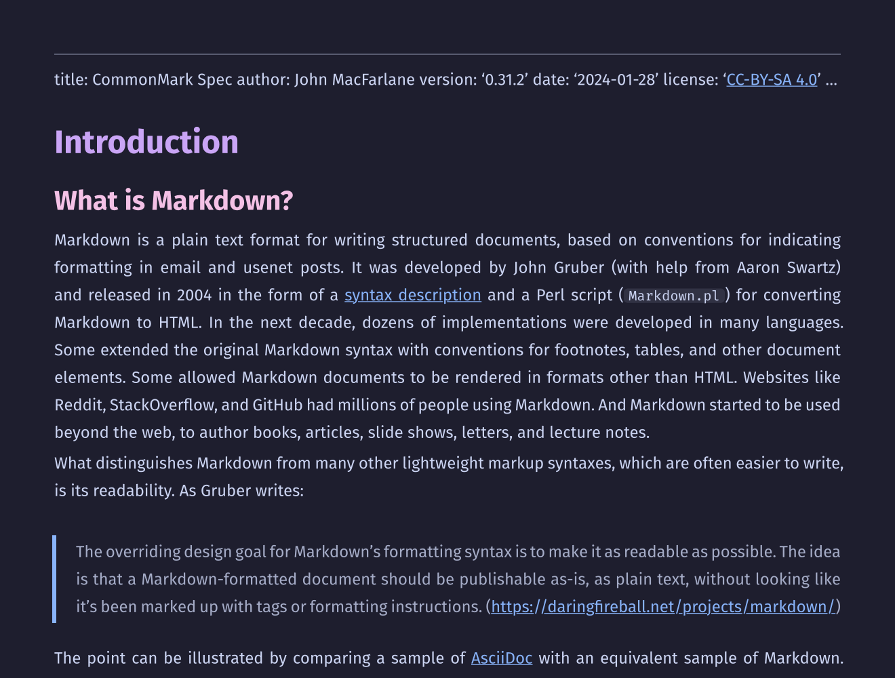

# mlux

[](https://github.com/saka1/mlux/actions/workflows/ci.yml)

A rich Markdown viewer for modern terminals,
powered by Rust and [Typst](https://typst.app/).



## How it works

Modern terminals like [Kitty](https://sw.kovidgoyal.net/kitty/) and [Ghostty](https://ghostty.org/) that support the
[Kitty Graphics Protocol](https://sw.kovidgoyal.net/kitty/graphics-protocol/) can display
images inline. mlux takes advantage of this: it parses Markdown, converts it to Typst markup, and renders high-quality typeset output as a PNG image.
The built-in terminal viewer then displays the rendered document directly in your terminal.

## Features

- **Beautiful output** -- Typst's typesetting engine handles line breaking, paragraph
  spacing, headings, code blocks, tables, blockquotes, and more.
- **Images and math** -- Local images and LaTeX math formulas (`$...$`, `$$...$$`) are
  rendered inline.
- **Mermaid diagrams** -- Fenced `mermaid` code blocks are rendered as SVG diagrams
  inline.
- **Terminal viewer** -- View rendered Markdown directly in your terminal with
  pixel-precise line numbers, vim-style scrolling, and tile-based lazy rendering.
  Requires a terminal that supports the Kitty Graphics Protocol (e.g. Ghostty, Kitty).
- **Link navigation** -- Press `No` on a local `.md` link to jump to that file (tag-jump).
  `Ctrl-O` returns to the previous file with scroll position restored.
- **Search** -- Press `/` to grep Markdown source lines with regex and jump to matches.
- **URL picker** -- Press `O` to list all URLs in the document and open one in your browser.
- **Yank** -- Copy source lines or blocks to clipboard via OSC 52 (`Ny`, `NY`).
- **File watching** -- Automatically re-renders when the source file changes.
- **Stdin support** -- Pipe Markdown via stdin: `cat README.md | mlux -`.

## Requirements

mlux requires a terminal that supports the
[Kitty Graphics Protocol](https://sw.kovidgoyal.net/kitty/graphics-protocol/).
Compatible terminals include [Kitty](https://sw.kovidgoyal.net/kitty/) and [Ghostty](https://ghostty.org/).

## Installation

```
cargo install mlux
```

## Usage

```console
# View in terminal (default)
mlux input.md

# Render to PNG
mlux render input.md -o output.png

# Custom width, resolution, and theme
mlux render input.md -o output.png --width 800 --ppi 144 --theme catppuccin
```

### Viewer keybindings

| Key | Action |
|-----|--------|
| `j` / `k` | Scroll down / up |
| `d` / `u` | Half-page down / up |
| `g` / `G` | Jump to top / bottom |
| `[N]g` / `[N]G` | Jump to line N |
| `/` | Search (regex grep) |
| `n` / `N` | Next / previous search match |
| `[N]o` | Open URL on line N (jumps to local `.md` files) |
| `O` | URL picker (all URLs) |
| `Ctrl-O` | Go back (after link navigation) |
| `[N]y` / `[N]Y` | Yank line / block N |
| `t` | Table of contents (heading list + jump) |
| `:` | Command mode (`:q`, `:reload`, `:open`, `:back`) |
| `q` | Quit |

## Configuration

mlux reads settings from `~/.config/mlux/config.toml` (respects `$XDG_CONFIG_HOME`).
All fields are optional — omit any to use the default.

```toml
# Theme name (loaded from themes/{name}.typ)
theme = "catppuccin"

# Page width in pt (default: 660)
width = 660.0

# Resolution in pixels per inch (default: 144)
ppi = 144.0

[viewer]
# Scroll distance per j/k press in terminal cells (default: 3)
scroll_step = 3

# Redraw frame budget in milliseconds (default: 32)
frame_budget_ms = 32

# Minimum tile height in pt (default: 500)
tile_height = 500.0

# Sidebar width in terminal columns (default: 6)
sidebar_cols = 6

# LRU tile eviction distance (default: 4)
evict_distance = 4

# File watch polling interval in milliseconds (default: 200)
watch_interval_ms = 200
```

CLI options override config file values. For example, `mlux render input.md --ppi 288`
uses PPI 288 regardless of the config file.

## Security

mlux does its best to render safely, but there are a few things worth knowing:

- **Supply chain** — Like any Rust project, mlux pulls in third-party crates, so transitive dependencies carry the usual supply chain risk.
- **Filesystem sandbox** — The rendering pipeline runs in a subprocess with filesystem access restricted to the area around the input file. This relies on [Landlock](https://landlock.io/), so it only takes effect on recent Linux kernels.
- **Other platforms** — On non-Linux systems or older kernels, the sandbox is simply not applied.

Rendering untrusted Markdown is safer than executing arbitrary code, but it's not a guarantee. Keep that in mind when processing documents from untrusted sources.