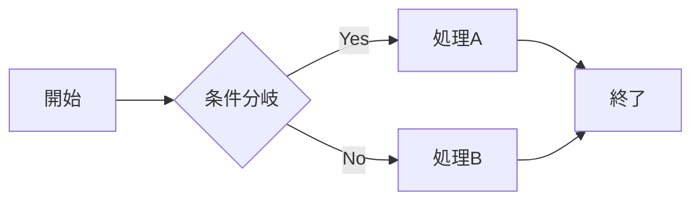
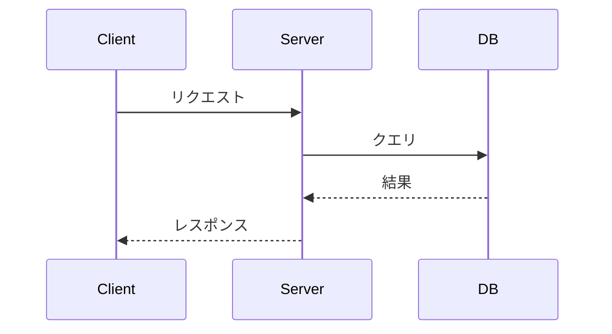
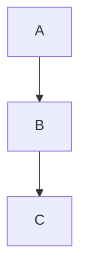

# Mermaid ダイアグラムテスト

## フローチャート


```mermaid
graph LR
  A[開始] --> B{条件分岐}
  B -->|Yes| C[処理A]
  B -->|No| D[処理B]
  C --> E[終了]
  D --> E
```

## シーケンス図


```mermaid
sequenceDiagram
  participant Client
  participant Server
  participant DB
  Client->>Server: リクエスト
  Server->>DB: クエリ
  DB-->>Server: 結果
  Server-->>Client: レスポンス
```

## 通常のコードブロック（影響なし）

```rust
fn main() {
    println!("Hello, world!");
}
```

## テキストの後にダイアグラム

Mermaid ダイアグラムはインライン SVG として描画されます。


```mermaid
graph TD
  A --> B
  B --> C
```
