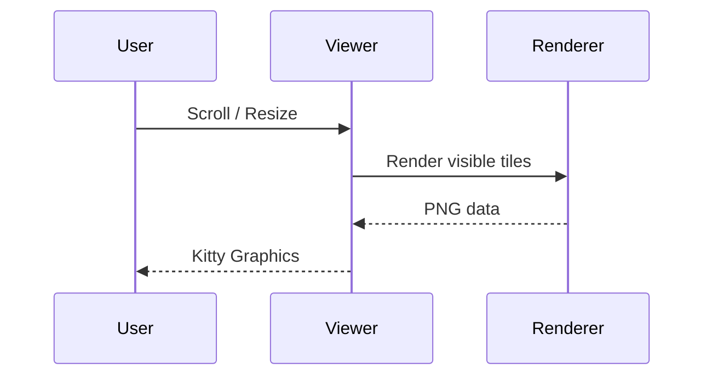

# Rendering Gallery

A compact showcase of mlux rendering capabilities.

## Headings

### Third-level heading

#### Fourth-level heading

##### Fifth-level heading

###### Sixth-level heading

## Math

The Schrödinger equation describes quantum state evolution:

$$i\hbar \frac{\partial}{\partial t} \Psi(r, t) = \left[ -\frac{\hbar^2}{2m} \nabla^2 + V(r, t) \right] \Psi(r, t)$$

Matrix delimiters and a piecewise function:

$$\begin{pmatrix} a & b \\ c & d \end{pmatrix}, \quad \begin{bmatrix} 1 & 0 \\ 0 & 1 \end{bmatrix}, \qquad f(x) = \begin{cases} 1 & \text{if } x > 0 \\ 0 & \text{otherwise} \end{cases}$$

A function $f: \mathbb{R} \to \mathbb{R}$ is differentiable at $x_0$ if the limit $f'(x_0) = \lim_{h \to 0} \frac{f(x_0 + h) - f(x_0)}{h}$ exists. If $f(x) = x^n$, then $f'(x) = nx^{n-1}$.

## Diagrams

